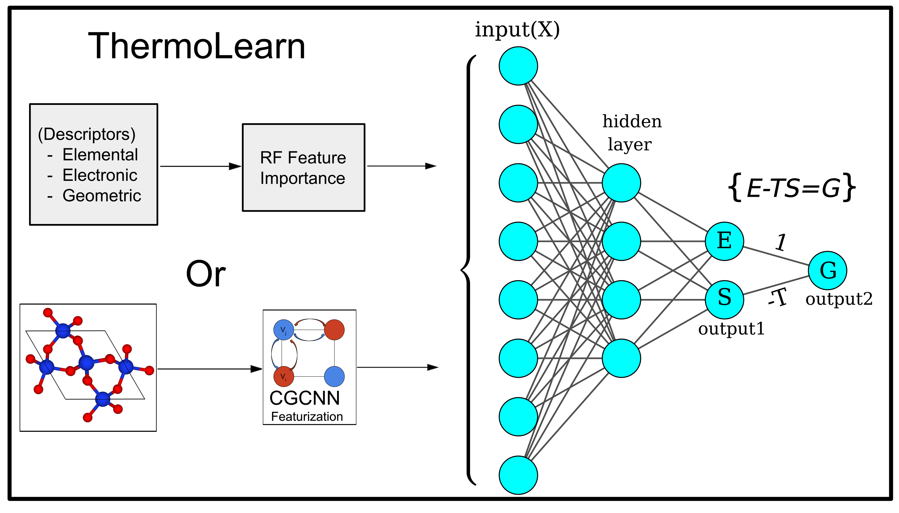

#  ThermoLearn — Thermodynamic Property Prediction via Neural Networks

This repository provides PyTorch-based implementations of both traditional neural networks and **Physics-Informed Neural Networks (PINNs)** for thermodynamic property regression. It utilizes the **JANAF** thermodynamic dataset and **PhononDb** datasets. The neural network constrained by the Gibbs free energy relation (G = H - TS), ensuring thermodynamic consistency. Benchmarked the model against traditional approaches, demonstrating superior performance, particularly in out-of-distribution (OOD) scenarios. [Please follow this link to the ChemRxiv paper for more details](https://chemrxiv.org/engage/chemrxiv/article-details/66b8a0fcc9c6a5c07ae4a901)

---

## 📁 Repository Structure
There are two sub-folders in the main repository, Standard and OOD/JANAF. 
The standard contains both the NIST-JANAF and PhononDb data. PINN and the normal neural network are hyper-optimized using conventional validation protocols like train test split and cross-validation. 
JANAF/OOD contains only the experimental NIST data, in this case we train and test on separate clusters the so-called out-of-distribution(OOD) scenario. Refer to the paper for more details.
The repository contains the code for benchmarking only the PINN and normal NN. Scripts for benchmarking against Megnet, CGCNN and other methods mentioned in the paper should be uploaded soon(maybe in a supporting repository), Same goes for the script required to make the OOD clusters.  

```
Repo Strucutre 
ThermoLearn/
├── Standard/
│   └── JANAF/
│       ├── thermo_net/
│       │   ├── [torch_neural.py](./thermo_net/torch_neural.py)
│       │   ├── [torch_neural_new.py](./thermo_net/torch_neural_new.py)
│       ├── [hyopt_normal_nn.py](./hyopt_normal_nn.py)
│       ├── [hyopt_tln.py](./hyopt_tln.py)
│       ├── [normal_average.csv](./normal_average.csv)
│       ├── [tln_scores.csv](./tln_scores.csv)
```

---

## 📌 Main Components

### [`torch_neural_new.py`](./Standard/JANAF/thermo_net/torch_neural_new.py)
> 🧠 **Core script** implementing:
- A **standard feedforward neural network** for property regression.
- A **PINN architecture** where thermodynamic constraints are built into the loss function.
- Modular class design for reuse in multiple experiments.

---

### [`hyopt_normal_nn.py`](./hyopt_normal_nn.py)
> 🔧 Hyperparameter tuning script for the **normal neural network**.
- Loads models from `torch_neural_new.py`
- Performs optimization (e.g., learning rate, number of hidden layers)
- Uses `normal_average.csv` as input

---

### [`hyopt_tln.py`](./hyopt_tln.py)
> 🔬 Hyperparameter tuning script for the **PINN model**.
- Loads physics-informed network from `torch_neural_new.py`
- Optimizes parameters while enforcing thermodynamic consistency
- Suitable for real-world material thermodynamic property estimation

---

## 📊 Data Files

- [`normal_average.csv`](./normal_average.csv): Standardized input data used in `hyopt_normal_nn.py`
- [`tln_scores.csv`](./tln_scores.csv): Output evaluation scores (e.g., MAE, MSE, constraint errors) for the PINN models

---

## 🚀 Usage

Install required dependencies:

```bash
pip install torch pandas numpy matplotlib
```

Run the hyperparameter tuning:

```bash
# For PINN
python hyopt_tln.py

# For Normal Neural Network
python hyopt_normal_nn.py
```

---

## 📂 Legacy

- [`torch_neural.py`](./thermo_net/torch_neural.py): An earlier version of the neural network codebase, now superseded by `torch_neural_new.py`

---

## 👤 Author

Developed by **Sudo-Raheel**

> Commit Message: _"added standard hyopt files"_

---

## 📄 License

[MIT License](https://opensource.org/licenses/MIT)

---

> 📬 Feel free to open issues or pull requests if you find bugs or want to contribute new features!
